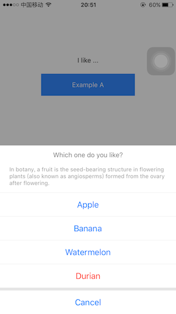
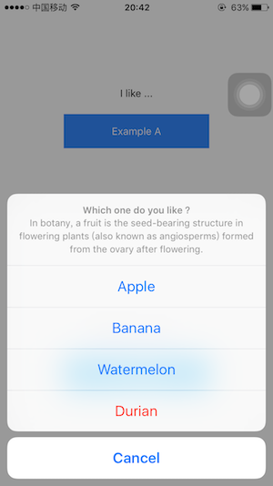

# react-native-actionsheet
[](https://www.npmjs.com/package/@alessiocancian/react-native-actionsheet)\
Cross platform ActionSheet. This component implements a custom ActionSheet  and provides the same way to drawing it on the defferent platforms(iOS and Android). Actually, In order to keep the best effect, it still uses the ActionSheetIOS on iOS.

<table>
  <tbody>
    <tr>
      <td align="center" valign="top">
        
      </td>
      <td align="center" valign="top">
        
      </td>
    </tr>
  </tbody>
</table>


Starting from v3.0.0 a custom ActionSheet with a native-like UI is available and used as default option for iOS:
<table>
  <tbody>
    <tr>
      <td align="center" valign="top">
        
      </td>
      <td align="center" valign="top">
        
      </td>
    </tr>
  </tbody>
</table>

A similar UI is available for Android too by passing `theme="ios"`:
<table>
  <tbody>
    <tr>
      <td align="center" valign="top">
        
      </td>
      <td align="center" valign="top">
        
      </td>
    </tr>
  </tbody>
</table>


## Install

```
npm i -S @alessiocancian/react-native-actionsheet
```

## Usage

```js
import ActionSheet from '@alessiocancian/react-native-actionsheet'

class Demo extends React.Component {
  showActionSheet = () => {
    this.ActionSheet.show()
  }
  render() {
    return (
      <View>
        <Text onPress={this.showActionSheet}>Open ActionSheet</Text>
        <ActionSheet
          ref={o => this.ActionSheet = o}
          title={'Which one do you like ?'}
          options={['Apple', 'Banana', 'cancel']}
          cancelButtonIndex={2}
          destructiveButtonIndex={1}
          onPress={(index) => { /* do something */ }}
        />
      </View>
    )
  }
}
```


### Use ActionSheetCustom directly

so you can customize option and title

```js
import { ActionSheetCustom as ActionSheet } from '@alessiocancian/react-native-actionsheet'

const options = [
  'Cancel', 
  'Apple', 
  <Text style={{color: 'yellow'}}>Banana</Text>,
  'Watermelon', 
  <Text style={{color: 'red'}}>Durian</Text>
]

class Demo extends React.Component {
  showActionSheet = () => {
    this.ActionSheet.show()
  }
  render() {
    return (
      <View>
        <Text onPress={this.showActionSheet}>Open ActionSheet</Text>
        <ActionSheet
          ref={o => this.ActionSheet = o}
          title={<Text style={{color: '#000', fontSize: 18}}>Which one do you like?</Text>}
          options={options}
          cancelButtonIndex={0}
          destructiveButtonIndex={4}
          onPress={(index) => { /* do something */ }}
        />
      </View>
    )
  }
}
```

### How to redesign style ?

The style of ActionSheet is defined in [lib/styles.js](https://github.com/alessiocancian/react-native-actionsheet/blob/master/lib/styles.js). We can pass the `styles` prop to cover default style. See [Example](https://github.com/alessiocancian/react-native-actionsheet/blob/master/example/app/ExampleB.js#L48) .

```javascript
// example

const styles = {
  titleBox: {
    background: 'pink'
  },
  titleText: {
    fontSize: 16,
    color: '#000'
  }
}

<ActionSheet
  ...
  styles={styles}
/>
```

## Props

https://github.com/alessiocancian/react-native-actionsheet/blob/master/lib/options.js

<table>
    <tr>
        <th>Prop name</th>
        <th>Type</th>
        <th>Description</th>
        <th>Default</th>
    </tr>
    <tr>
        <td>title</td>
        <td>string or ReactNode</td>
        <td>ActionSheetCustom needed to use ReactNode for iOS</td>
        <td></td>
    </tr>
    <tr>
        <td>message</td>
        <td>string or ReactNode</td>
        <td>ActionSheetCustom needed to use ReactNode for iOS</td>
        <td></td>
    </tr>
    <tr>
        <td>options</td>
        <td>(string | ReactChild)[]</td>
        <td>ActionSheetCustom needed to use ReactChild options for iOS</td>
        <td></td>
    </tr>
    <tr>
        <td>tintColor</td>
        <td>string</td>
        <td></td>
        <td></td>
    </tr>
    <tr>
        <td>cancelButtonIndex</td>
        <td>number</td>
        <td></td>
        <td></td>
    </tr>
    <tr>
        <td>destructiveButtonIndex</td>
        <td>number</td>
        <td></td>
        <td></td>
    </tr>
    <tr>
        <td>onPress</td>
        <td>function</td>
        <td></td>
        <td></td>
    </tr>
    <tr>
        <td>userInterfaceStyle</td>
        <td>"light" | "dark"</td>
        <td>RN version >=0.63</td>
        <td>System theme</td>
    </tr>
    <tr>
        <td>theme</td>
        <td>"flat" | "ios"</td>
        <td></td>
        <td>flat for Android and native or native-like for iOS</td>
    </tr>
    <tr>
        <td>styles</td>
        <td></td>
        <td>only for ActionSheetCustom</td>
        <td>{}</td>
    </tr>
</table>
